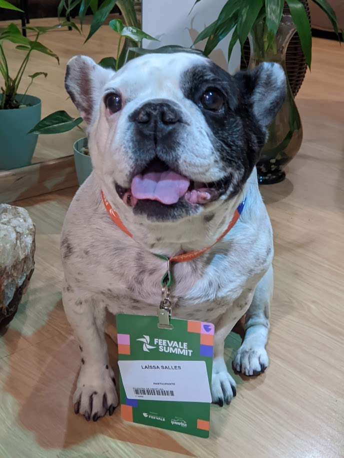

<p align="center">
  
</p>

> um joguinho criado em python e com doses de carinho

---

## sobre a doroty

esse jogo nasceu como uma entrega acadêmica, mas ganhou um significado especial com o tempo.

doroty foi meu pequeno presente de quinze anos, me acompanhou durante minha trajetória de adolescência e vida adulta, dos meus 14 aos 26.

na época da construção do jogo, ela já apresentava os primeiros sinais de doença, que só foram percebidos ao passar dos meses. parte da brincadeira do jogo é justamente sobre as idas dela ao veterinário, que pareciam apenas pequenos sustos.

em dezembro de 2025, veio a notícia do câncer. fizemos tratamento paliativo e ela continuou conosco por mais dois meses.

hoje, esse projeto é uma forma de eternizar a sua memória e afeto. 

---

<p align="center">
  
</p>

## o jogo

**passeio com a doroty** é um jogo de sobrevivência em que você controla a personagem pelo cenário e precisa escapar de comidas e obstáculos durante **60 segundos**.

```
  movimente a personagem pelo mapa
  desvie das comidas e obstáculos
  sobreviva até o tempo acabar
```

desenvolvido para a cadeira de **Programação II**, no segundo semestre de 2025, **Universidade Feevale**, Novo Hamburgo/RS.

assista à apresentação: https://youtu.be/PG4gKpCtUQo

---

## stack

```
Python   Pygame   Pixel Art   OOP
```

---

## estrutura

```
game-doroty/
│
├── assets/           imagens, sons, fontes e elementos visuais
│
├── Game.py           arquivo principal
├── Player.py         classe da personagem
├── Obstacle.py       classe dos obstáculos
├── ScreenManager.py  gerenciamento de telas
└── SoundManager.py   gerenciamento de sons
```

---

<p align="center">
  
</p>

## como rodar

recomendo **Python 3.12** ou **3.13**, versões mais recentes podem ter problemas com o Pygame.

**clone o repositório**

```bash
git clone https://github.com/sdl9/passeio-com-a-doroty.git
cd passeio-com-a-doroty
```

---

**Windows**

```powershell
py -3.13 -m venv .venv
.\.venv\Scripts\Activate.ps1

python -m pip install --upgrade pip
python -m pip install pygame

python Game.py
```

---

**Linux / macOS**

```bash
python3 -m venv .venv
source .venv/bin/activate

python -m pip install --upgrade pip
python -m pip install pygame

python Game.py
```

---

**via requirements.txt**

```bash
python -m pip install -r requirements.txt
```

```txt
pygame==2.6.1
```

---

<p align="center">
  
</p>

## problemas comuns

**`ModuleNotFoundError: No module named 'pygame'`**
o Pygame não foi instalado no ambiente atual.

```bash
python -m pip install pygame
```

---

**pygame tentando compilar no Windows**
provavelmente você está usando Python 3.14+. prefira 3.12 ou 3.13, recrie o ambiente virtual e instale o Pygame novamente.

```bash
python --version
```

---

**arquivos da pasta `assets` não encontrados**
execute o jogo sempre de dentro da pasta principal do projeto.

```bash
cd passeio-com-a-doroty
python Game.py
```

---

## créditos

as artes em pixel art foram geradas com o **PixelLab** (https://www.pixellab.ai) e refinadas com apoio do ChatGPT, mantendo a proposta visual e a identidade da personagem.

---

## autora

**laíssa dornelles salles**

<p align="center">
  
</p>

https://github.com/sdl9